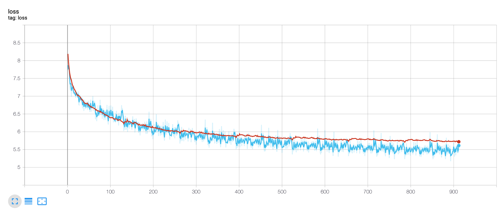

# Word-level RNN-based Language Model enhanced with character-level knowledge

### This language model is written in PyTorch.

By giving ['word','character'] to the features_level argument, your model first tries to learn subword features (i.e. prefixes, suffixes, etc.) using a character-level CNN. Then the extracted feature vector of each word is concatenated with its word embedding, and is finally fed into a n-layer LSTM. You are free to try other values for features_level.

#### To train the model on your own corpus, simply call Train.py with its arguments.

The arguments are as follows:

* '--corpus_train_file' : 'location of the data corpus for training'
* '--corpus_valid_file': 'location of the data corpus for validation'
* '--embeddings_file' : 'If pretrained embeddings exist, load them here.'
* '--output_model_path' : 'Path to save the trained model.'
* '--output_id2word_path' : 'Path to save dictionary file (id2word)'
* '--output_word2id_path' : 'Path to save dictionary file (word2id)'
* '--output_id2char_path' : 'Path to save dictionary file (id2char)'
* '--output_char2id_path' : 'Path to save dictionary file (char2id)'

* '--n_layers' : 'Number of LSTM layers stacked on top of each other.'
* '--hidden_size' : 'Number of hidden units in each LSTM layer'
* '--features_level' : 'Specify the level of features by which you want to represent your words. Default value is ['word', 'character']'
* '--cnn_kernels' : CNN Kernels : (n_kernel,width_kernel). Sample input: (10,2) (30,3) (40,4) (40,5). Notice the spaces and parentheses.
* '--character_embedding_dim' : The dimension of the character embeddings

* '--dropout_probablity' : 'Dropout probablity applied on embeddings layer and LSTM layer.'
* '--embeddings_dim' : 'The dimension of the embeddings'
* '--batch_size' : 'Number of samples per batch.'
* '--seq_len' : 'Length of the sequence for back propagation.'
* '--epochs' : 'Number of epochs.'
* '--lr' : 'Learning rate.'
* '--seed' : 'The seed for randomness'
* '--clip_grad' : 'Clip gradients during training to prevent exploding gradients.'
* '--print_steps' : 'Print training info every n steps.'
* '--bidirectional_model' : 'Use it if you want your LSTM to be bidirectional.'
* '--tie_weights' : 'Tie weights of the last decoder layer to the embeddings layer.'
* '--freez_embeddings' : 'Prevent the pretrained loaded embeddings from fine-tuning.'
* '--gpu' : 'Turn it on if you have a GPU device.'

#### To test the model with generating a new text, simply call Test.py with the following arguments:

* '--model_path' : 'Path to the pre-trained model.'
* '--id2word_path' : 'Path to the dictionary file (id2word)'
* '--word2id_path' : 'Path to the dictionary file (word2id)'
* '--seed_word' : 'The seed word to generate a new text'
* '--gpu' : 'Turn it one if you have a GPU device'

********Note:Test Script is not complete yet. Character support is not added yet.

#### Feel free to contribute to this model.
